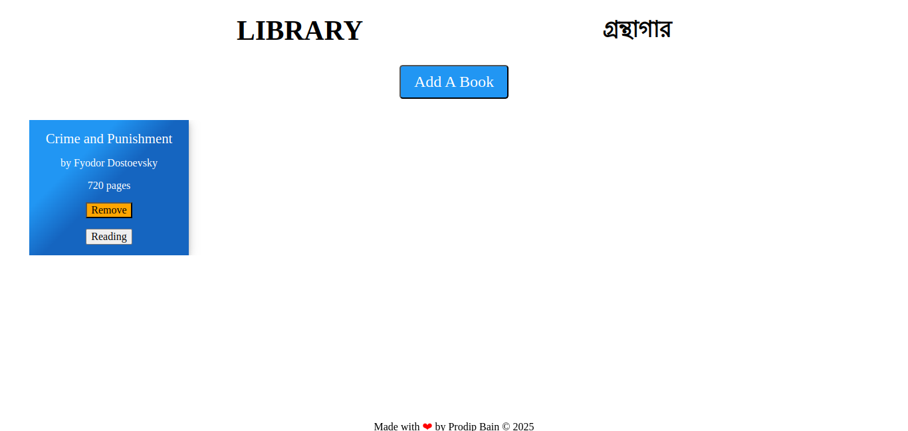
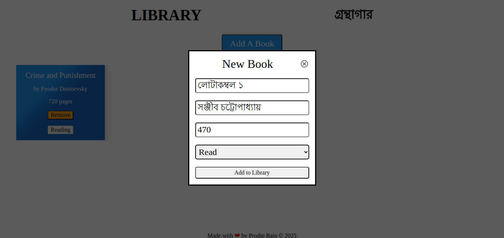
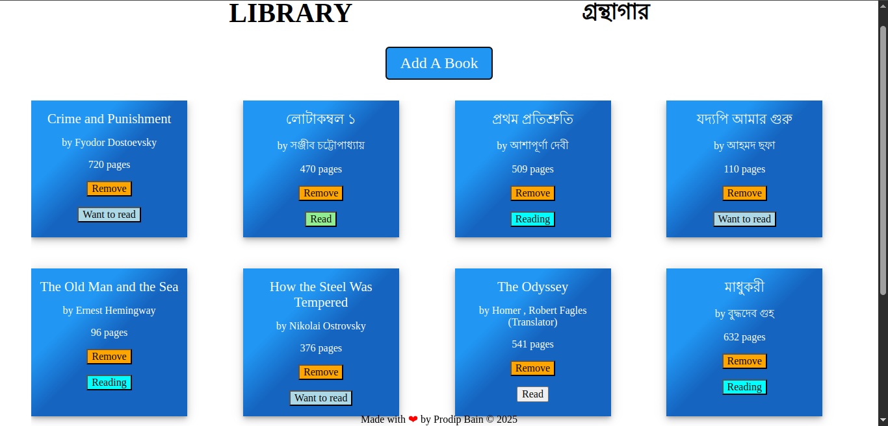

# Library App

## Overview

A simple web-based library application that allows users to:

- Add new books with details (title, author, pages, read status)

- View all books in their collection

- Toggle read status

- Remove books from the library

## [Live Demo](https://pbain63.github.io/Project_Library/)

---

## Screenshots:

| In general View                                                  | Add a cart to library                                            | After adding books                                                               |
| ---------------------------------------------------------------- | ---------------------------------------------------------------- | -------------------------------------------------------------------------------- |
|  |  |  |

---

## Features

### Book Management:

- Add new books via a form

- Toggle read/unread status

- Remove books from the library

---

**Interactive UI**:

- Elegant CSS animations for form transitions when opening/closing the form
- Clean, card-based book display

---

### Data Persistence:

- Books are stored in browser's local storage

---

## Installation

1. Clone the repository:

   `git clone https://github.com/pbain63/library-app.git`

2. Open `index.html` in your browser

---

## Usage

1. Click "Add A Book" button to add a book

2. Fill in the book details in the form

3. Submit to add the book to your library

4. Use the buttons on each book card to:

   - Toggle read status

   - Remove the book

---

## Technology:

HTML5, CSS3, JavaScript, Git for version control

---
